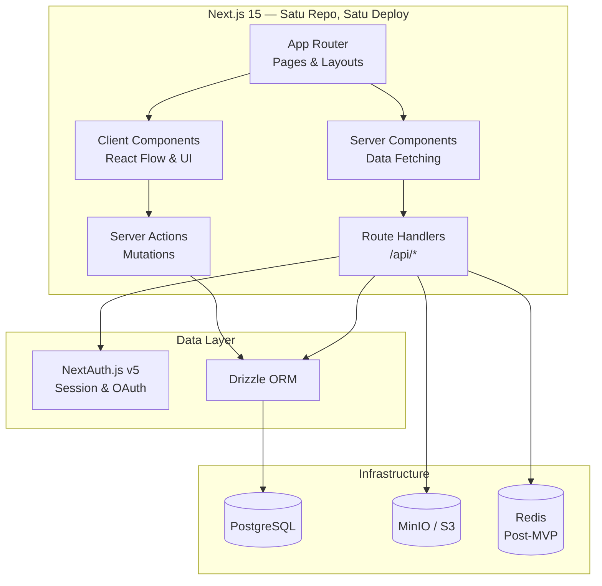
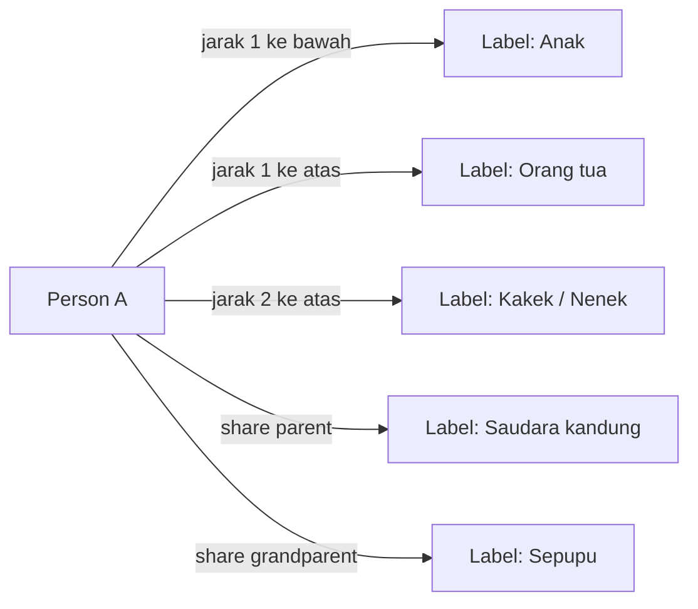
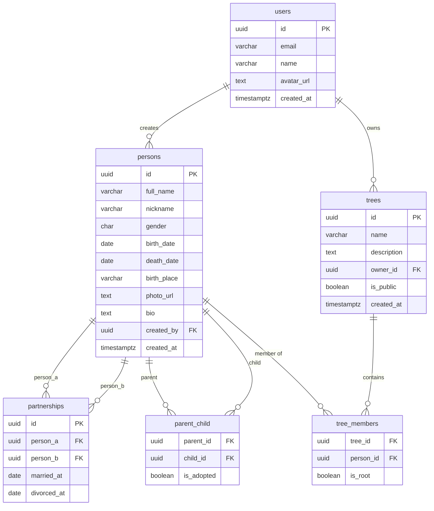
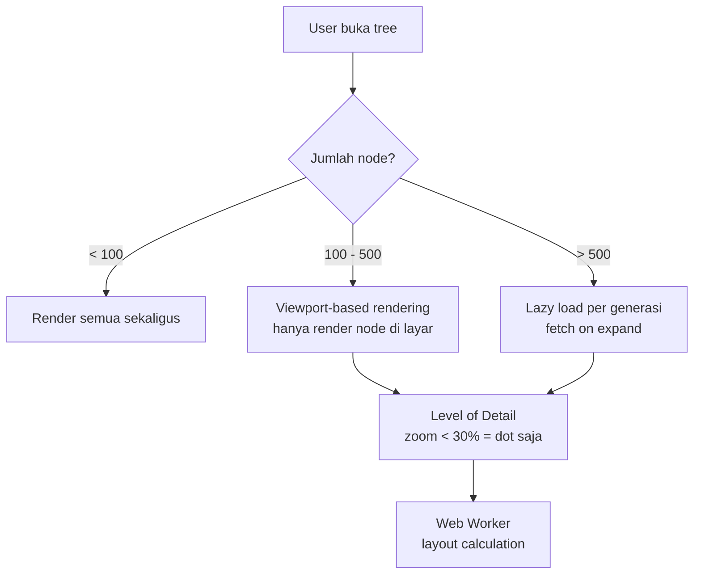
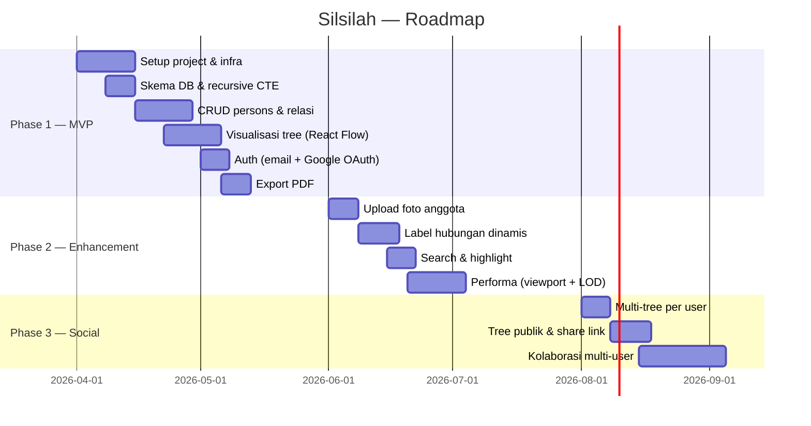

# PRD — Silsilah
> Platform Pohon Keluarga Digital · Versi 1.3 · April 2026
> _Stack final: Next.js Fullstack + Drizzle ORM + NextAuth.js + PostgreSQL_

---

## 1. Overview

### 1.1 Latar Belakang

Silsilah keluarga adalah bagian penting dari identitas budaya, khususnya dalam konteks masyarakat Minang dan Indonesia pada umumnya yang memiliki sistem kekerabatan yang kuat. Namun hingga saat ini belum ada platform digital publik yang menyediakan pengalaman membuat dan berbagi silsilah keluarga secara visual, intuitif, dan mudah diakses.

Platform **Silsilah** hadir untuk menjawab kebutuhan tersebut — memberikan cara yang sederhana, elegan, dan modern untuk mendokumentasikan dan menjelajahi pohon keluarga.

### 1.2 Tujuan Produk

- Menyediakan platform publik untuk membuat pohon silsilah keluarga secara digital
- Menghadirkan visualisasi family tree yang interaktif, ringan, dan mudah digunakan
- Mendukung export silsilah dalam format PDF untuk keperluan dokumentasi
- Membangun fondasi yang skalabel untuk fitur kolaborasi multi-user di masa mendatang

### 1.3 Target Pengguna

- Individu yang ingin mendokumentasikan silsilah keluarganya
- Komunitas atau klan yang ingin melestarikan sejarah keluarga secara digital
- Peneliti genealogi atau sejarawan lokal

---

## 2. Scope & Fitur

### 2.1 Ringkasan Fitur

| Fitur | MVP | Post-MVP |
|---|:---:|:---:|
| Family tree visual interaktif (pan, zoom) | ✓ | |
| Tambah / edit anggota keluarga | ✓ | |
| Relasi pasangan & keturunan | ✓ | |
| Export PDF | ✓ | |
| Auth (email + social login) | ✓ | |
| Upload foto anggota | ✓ | |
| Label hubungan dinamis (computed dari graph) | ✓ | |
| Multi-tree per user | | ✓ |
| Kolaborasi keluarga (multi-user edit) | | ✓ |
| Tree publik & share link | | ✓ |
| Search & highlight anggota | | ✓ |
| Generational filter (tampilkan N generasi) | | ✓ |
| Deteksi siklus (perkawinan kerabat) | | ✓ |

### 2.2 Out of Scope (V1)

- Integrasi dengan platform silsilah eksternal (MyHeritage, Ancestry)
- DNA matching atau fitur biologis
- Monetisasi / fitur premium
- Aplikasi mobile native (iOS / Android)

---

## 3. User Stories

### 3.1 Membuat & Mengelola Silsilah

- Sebagai pengguna, saya ingin membuat pohon silsilah baru dengan nama keluarga saya
- Sebagai pengguna, saya ingin menambahkan anggota keluarga beserta informasi dasar (nama, tanggal lahir, foto)
- Sebagai pengguna, saya ingin menghubungkan anggota sebagai pasangan atau keturunan
- Sebagai pengguna, saya ingin mengedit atau menghapus anggota keluarga

### 3.2 Visualisasi

- Sebagai pengguna, saya ingin melihat silsilah dalam bentuk pohon visual yang bisa saya navigasi (pan & zoom)
- Sebagai pengguna, saya ingin mengklik kartu anggota untuk melihat detail lengkapnya
- Sebagai pengguna, saya ingin melihat label hubungan yang dihitung otomatis berdasarkan posisi dalam tree

### 3.3 Export

- Sebagai pengguna, saya ingin mengekspor silsilah ke dalam format PDF untuk dicetak atau dibagikan

### 3.4 Akun & Akses

- Sebagai pengguna, saya ingin mendaftar dan login menggunakan email atau akun Google
- Sebagai pengguna, saya ingin data silsilah saya tersimpan secara persisten dan aman

---

## 4. Arsitektur & Tech Stack

### 4.1 Tech Stack

| Layer | Teknologi | Keterangan |
|---|---|---|
| Framework | Next.js 15 (App Router) | Fullstack, SSR, routing, API |
| UI | React + React Flow | Tree visualization, pan/zoom |
| Styling | Tailwind CSS | Utility-first, konsisten |
| PDF Export | html2canvas + jsPDF | Client-side export, MVP-ready |
| ORM | Drizzle ORM | Type-safe, SQL-first, ringan |
| Database | PostgreSQL | Relasi graph via recursive CTE |
| Auth | NextAuth.js v5 (Auth.js) | Email + Google OAuth, session built-in |
| Storage | S3-compatible (MinIO) | Foto & dokumen anggota |
| Deploy | Vercel | Zero-config, gratis untuk MVP |

### 4.2 High-Level Architecture



### 4.3 Struktur Project

Fullstack JS memungkinkan satu repo untuk frontend dan backend:

```
silsilah/
├── app/                            # Next.js App Router
│   ├── (auth)/
│   │   ├── login/page.tsx
│   │   └── register/page.tsx
│   ├── (dashboard)/
│   │   ├── layout.tsx
│   │   ├── page.tsx                # Daftar tree milik user
│   │   └── tree/[id]/page.tsx      # Halaman visualisasi tree
│   └── api/
│       ├── auth/[...nextauth]/route.ts
│       ├── persons/
│       │   ├── route.ts            # GET list, POST create
│       │   └── [id]/route.ts       # GET, PATCH, DELETE
│       ├── trees/
│       │   ├── route.ts
│       │   └── [id]/
│       │       ├── route.ts
│       │       └── members/route.ts
│       └── relationships/route.ts
│
├── components/
│   ├── tree/
│   │   ├── TreeCanvas.tsx          # React Flow wrapper (client)
│   │   ├── PersonNode.tsx          # Custom node card
│   │   └── EdgeTypes.tsx           # Spouse & parent edges
│   └── ui/                         # Shared UI components
│
├── lib/
│   ├── db/
│   │   ├── schema.ts               # Drizzle schema
│   │   ├── index.ts                # DB connection
│   │   └── queries/
│   │       ├── persons.ts
│   │       ├── trees.ts
│   │       └── relationships.ts    # Recursive CTE queries
│   ├── auth.ts                     # NextAuth config
│   └── relationship.ts             # Computed label logic
│
├── drizzle.config.ts
├── next.config.ts
└── package.json
```

### 4.4 Kenapa Next.js Fullstack?

| | Next.js Fullstack | React + Elysia + Bun |
|---|---|---|
| Setup & deploy | Sangat mudah (Vercel) | Perlu VPS + konfigurasi manual |
| Ekosistem & docs | Sangat mature | Elysia masih muda |
| Auth | NextAuth proven & lengkap | Lebih banyak effort |
| Solo / tim kecil | ✓ Ideal | Overkill untuk MVP |
| Go-to-market | Lebih cepat | Lebih lambat |
| Performa API | Cukup untuk scale | Lebih tinggi, tapi belum dibutuhkan |

> **Kesimpulan:** Untuk platform publik yang dibangun solo atau tim kecil, Next.js fullstack memberikan kecepatan development dan kemudahan deploy yang jauh lebih baik di fase awal. Optimasi performa bisa dilakukan setelah product-market fit tercapai.

### 4.5 Keputusan Desain Penting

> **Label hubungan TIDAK disimpan di database.**
>
> Label seperti "Ayah", "Kakek", "Sepupu" bersifat relatif terhadap sudut pandang (POV). Dari POV A → B adalah "Anak", dari POV B → A adalah "Ayah". Label dihitung secara dinamis di layer service berdasarkan **jarak graph** antara dua node.



---

## 5. Database Design

### 5.1 Entity Relationship



### 5.2 DDL

```sql
-- Users
CREATE TABLE users (
    id          UUID PRIMARY KEY DEFAULT gen_random_uuid(),
    email       VARCHAR(150) UNIQUE NOT NULL,
    name        VARCHAR(100),
    avatar_url  TEXT,
    created_at  TIMESTAMPTZ DEFAULT now()
);

-- Persons
CREATE TABLE persons (
    id          UUID PRIMARY KEY DEFAULT gen_random_uuid(),
    full_name   VARCHAR(150) NOT NULL,
    nickname    VARCHAR(50),
    gender      CHAR(1) CHECK (gender IN ('M', 'F')),
    birth_date  DATE,
    death_date  DATE,
    birth_place VARCHAR(100),
    photo_url   TEXT,
    bio         TEXT,
    created_by  UUID REFERENCES users(id),
    created_at  TIMESTAMPTZ DEFAULT now(),
    updated_at  TIMESTAMPTZ DEFAULT now()
);

-- Pasangan (simetris, tanpa arah)
CREATE TABLE partnerships (
    id          UUID PRIMARY KEY DEFAULT gen_random_uuid(),
    person_a    UUID NOT NULL REFERENCES persons(id),
    person_b    UUID NOT NULL REFERENCES persons(id),
    married_at  DATE,
    divorced_at DATE,
    CONSTRAINT no_self      CHECK (person_a <> person_b),
    CONSTRAINT unique_pair  UNIQUE (
        LEAST(person_a::text, person_b::text),
        GREATEST(person_a::text, person_b::text)
    )
);

-- Keturunan (berarah: parent → child)
CREATE TABLE parent_child (
    parent_id   UUID NOT NULL REFERENCES persons(id),
    child_id    UUID NOT NULL REFERENCES persons(id),
    is_adopted  BOOLEAN DEFAULT false,
    PRIMARY KEY (parent_id, child_id),
    CONSTRAINT no_self CHECK (parent_id <> child_id)
);

-- Trees
CREATE TABLE trees (
    id          UUID PRIMARY KEY DEFAULT gen_random_uuid(),
    name        VARCHAR(100) NOT NULL,
    description TEXT,
    owner_id    UUID NOT NULL REFERENCES users(id),
    is_public   BOOLEAN DEFAULT false,
    created_at  TIMESTAMPTZ DEFAULT now()
);

-- Tree Members
CREATE TABLE tree_members (
    tree_id     UUID REFERENCES trees(id) ON DELETE CASCADE,
    person_id   UUID REFERENCES persons(id) ON DELETE CASCADE,
    is_root     BOOLEAN DEFAULT false,
    PRIMARY KEY (tree_id, person_id)
);

-- Index untuk graph traversal
CREATE INDEX idx_pc_parent   ON parent_child(parent_id);
CREATE INDEX idx_pc_child    ON parent_child(child_id);
CREATE INDEX idx_ps_person_a ON partnerships(person_a);
CREATE INDEX idx_ps_person_b ON partnerships(person_b);
```

### 5.3 Query Rekursif

```sql
-- Ambil semua keturunan dari satu person, max 4 generasi
-- dengan deteksi siklus (PostgreSQL 14+)
WITH RECURSIVE descendants AS (
    SELECT id, full_name, gender, birth_date, 0 AS depth
    FROM persons
    WHERE id = $1

    UNION ALL

    SELECT p.id, p.full_name, p.gender, p.birth_date, d.depth + 1
    FROM persons p
    JOIN parent_child pc ON pc.child_id = p.id
    JOIN descendants d   ON d.id = pc.parent_id
    WHERE d.depth < 4
)
CYCLE id SET is_cycle USING path
SELECT * FROM descendants WHERE NOT is_cycle;
```

---

## 6. Visualisasi Tree

### 6.1 Pilihan Library

| Library | Pro | Con | Rekomendasi |
|---|---|---|---|
| React Flow | Siap pakai, customizable, pan/zoom built-in | Lisensi commercial untuk fitur advanced | ✓ MVP |
| D3.js | Paling fleksibel, free | Learning curve tinggi, build dari scratch | Post-MVP |
| FamilyChart.js | Khusus silsilah, handle multi-spouse | Komunitas kecil, docs terbatas | — |

### 6.2 Layout Direction

```
Vertikal   → antar generasi (atas ke bawah)
Horizontal → pasangan (kiri ke kanan)

[Kakek] ══ [Nenek]       ← garis pasangan (horizontal, dashed)
         │
      [Ayah] ══ [Ibu]    ← garis pasangan
              │
         ┌────┴────┐
       [Aku]   [Adik]    ← garis keturunan (vertikal, solid)
         │
    [Pasangan]
```

### 6.3 Strategi Performa



| Strategi | Impact | Prioritas |
|---|---|---|
| Viewport-based rendering | Render hanya node di layar | MVP |
| Lazy load per generasi | Fetch data saat expand | MVP |
| Level of Detail (LOD) | Simplifikasi node saat zoom out | MVP |
| Recursive CTE depth limit | Query efisien, batasi depth | MVP |
| Redis caching | Cache hasil query graph | Post-MVP |
| Web Worker layout calc | Layout di luar main thread | Post-MVP |

---

## 7. Non-Functional Requirements

### 7.1 Performa
- Tree hingga 200 node render dalam **< 2 detik**
- Pan & zoom berjalan pada **60fps** tanpa lag
- API response untuk fetch satu generasi **< 500ms**

### 7.2 Skalabilitas
- Layer API stateless (Next.js Route Handlers) — horizontal scaling ready
- Database index dioptimalkan untuk graph traversal
- Redis caching dipersiapkan untuk Post-MVP

### 7.3 Keamanan
- Autentikasi JWT dengan expiry token yang wajar
- Data silsilah **private by default** — hanya owner yang bisa mengakses
- Input validation di layer API
- HTTPS wajib di seluruh endpoint

### 7.4 Kompatibilitas
- Browser: Chrome, Firefox, Safari, Edge (2 tahun terakhir)
- Mobile: Responsive, mendukung touch pan & pinch zoom
- Export PDF: Konsisten di semua browser modern

---

## 8. Roadmap



---

## 9. Glosarium

| Istilah | Definisi |
|---|---|
| **Tree** | Satu instansi silsilah keluarga yang dimiliki seorang user |
| **Person** | Individu dalam silsilah, belum tentu punya akun di platform |
| **Partnership** | Relasi pasangan antar dua person (simetris, tanpa arah) |
| **Parent-Child** | Relasi keturunan yang berarah (parent → child) |
| **Root Node** | Titik awal render tree, biasanya leluhur tertua yang diketahui |
| **LOD** | Level of Detail — simplifikasi tampilan node berdasarkan zoom level |
| **Recursive CTE** | Fitur SQL untuk query hierarki/graph secara rekursif |
| **Computed Label** | Label hubungan yang dihitung dari jarak graph, tidak disimpan di DB |
| **Cycle Detection** | Pendeteksian siklus dalam graph (misal perkawinan antar kerabat) |

---

*Silsilah — PRD v1.3 · April 2026 · Next.js Fullstack Edition*